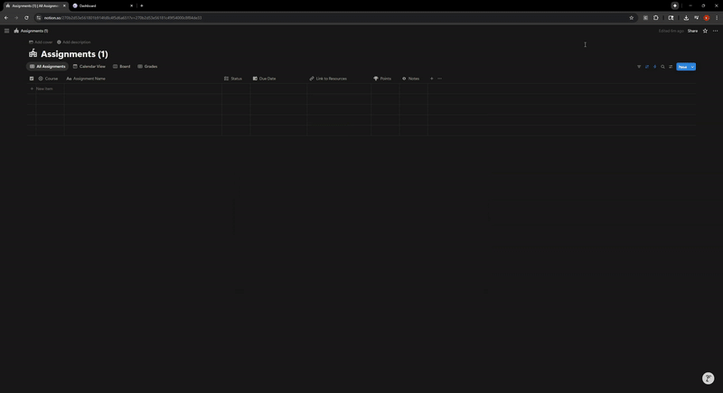

# Canvas-Notion Assignment Sync

A Chrome extension designed to automatically synchronize assignments from the Canvas Learning Management System with a Notion database. This tool is for students and educators who use Notion for task management and want to keep their academic assignments seamlessly updated.

  

## Core Features

* **Automatic Synchronization**: The extension periodically syncs assignments in the background (every 30 minutes) while you are actively using Canvas.
* **Comprehensive Data Sync**: Captures all essential assignment details, including the course name, due dates, point values, grades, and submission status.
* **Intelligent Deduplication**: Utilizes Canvas assignment IDs to prevent the creation of duplicate entries in your Notion database, ensuring a clean and accurate to-do list.
* **Respectful API Usage**: Implements a rate limiter to manage API calls to both Canvas and Notion, preventing service disruptions and ensuring smooth operation.
* **User-Friendly Configuration**: A simple popup interface allows for straightforward setup and management of your API tokens and database information.
* **Sync Notifications**: Provides on-screen notifications to keep you informed about the status of each sync operation, whether it completes successfully or encounters an issue.

## Installation Guide

To install the extension from the source code, please follow these steps:

1.  Download or clone this repository to your local machine.
2.  Open the Google Chrome browser and navigate to `chrome://extensions/`.
3.  Enable "Developer mode" using the toggle switch in the top-right corner of the page.
4.  Click on the "Load unpacked" button and select the directory where you saved the project files.
5.  Once loaded, the Canvas-Notion Sync extension icon will appear in your browser's toolbar.

## Configuration

Before you can begin syncing assignments, you will need to configure the extension to connect to your Notion and Canvas accounts.

### 1. Notion Database Setup

First, prepare your Notion database by ensuring it includes the following properties. The names should match exactly to ensure a successful sync.

* **Assignment Name** (Title)
* **Course** (Select)
* **Due Date** (Date)
* **Status** (Select)
* **Points** (Number)
* **Link to Resources** (URL)
* **Canvas ID** (Text)
* **Grade** (number)

### 2. Create a Notion Integration

Next, you'll need to create a Notion integration to allow the extension to access your database.

1.  Navigate to [notion.so/my-integrations](https://www.notion.so/my-integrations).
2.  Click on "New integration".
3.  Provide a name for your integration, such as "Canvas Sync".
4.  Copy the **Internal Integration Token** that is generated. You will need this for the extension configuration.
5.  Go to the "Access" tab for your new integration and add your assignments database.

### 3. Obtain a Canvas API Token

You will also need to generate an API token from your Canvas account.

1.  Log in to Canvas and go to **Account** > **Settings**.
2.  Scroll down to the **Approved Integrations** section.
3.  Click on **+ New Access Token**.
4.  Give the token a purpose, for example, "Notion Sync".
5.  Copy the generated token.

### 4. Configure the Extension

Finally, input the information you've gathered into the extension's settings.

1.  Click on the extension icon in your browser's toolbar.
2.  Enter the Notion Integration Token, the Notion Database ID, and the Canvas API Token into their respective fields.
3.  Click **Save Configuration**.
4.  You can use the "Test" buttons to verify that the connections to Notion and Canvas are working correctly.

## How to Use

Once configured, the extension is designed to work with minimal user interaction.

* **Automatic Sync**: The extension will automatically sync assignments in the background every 30 minutes, as long as you have a Canvas tab open in your browser.
* **Manual Sync**: If you need to sync your assignments immediately, you can open the extension popup and click the **Sync Now** button. A "Sync to Notion" button will also be available within the Canvas interface for quick access.

You can monitor the sync status and the time of the last sync from the extension's popup menu.

## Troubleshooting

If you encounter any issues, here are a few common problems and their solutions:

* **"Canvas API token required"**: This error indicates that a valid Canvas API token has not been saved in the extension's settings. Please verify your token and try again.
* **"Notion connection failed"**: This can be caused by an incorrect integration token or database ID. Ensure that your Notion database has been shared with the integration you created.
* **"No Canvas tabs found"**: For the sync to work, you must have an active tab open to a Canvas page.

## Technical Overview

* The extension is built using the **Canvas REST API (v1)** for extracting assignment data.
* It utilizes the **Notion API (v2025-09-03)** for all database operations.
* A custom rate limiter is in place to manage API requests, with an average of 3 requests per second and a burst capacity of 5 requests per second.
* All user credentials are encrypted using **AES-GCM** and stored securely in Chrome's local storage.

## Privacy and Security

The privacy and security of your data are a top priority.

* **Data Protection**: All communication occurs directly between your browser, Canvas, and Notion. No data is collected or transmitted to any third-party servers.
* **Secure Storage**: Your API tokens are encrypted before being stored locally on your machine.
* **Automatic Data Removal**: All stored credentials are automatically cleared from your browser when the extension is uninstalled. You can also manually clear all data at any time using the "Clear All Data" button in the extension's settings.

While this extension is designed with security in mind, please be aware that your API tokens provide extensive access to your Canvas and Notion accounts. It is recommended that you use this extension on a personal, secure computer and consider periodically rotating your API tokens.

## Support and Contributions

This is an open-source project. If you need assistance, would like to report a bug, or are interested in contributing, please feel free to open an issue or submit a pull request on the project's GitHub page.

## License

This project is licensed under the MIT License.