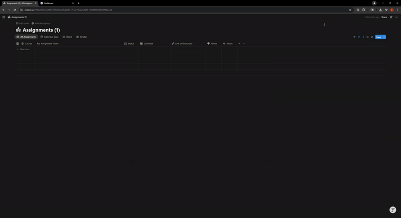

# Canvas-Notion Assignment Sync

A Chrome extension designed to automatically synchronize assignments from the Canvas Learning Management System with a Notion database. This tool is for students and educators who use Notion for task management and want to keep their academic assignments seamlessly updated.

<div align="center">
  
</div>

## Core Features

* **Automatic Synchronization**: Periodically syncs assignments in the background (every 30 minutes) while you are actively using Canvas.
* **Comprehensive Data Sync**: Captures all essential assignment details, including course name, due dates, point values, grades, submission status, and descriptions.
* **Intelligent Field-Level Diffing**: Compares each assignment field-by-field against a unified cache, only calling the Notion API when data has actually changed. This reduces Notion API usage by 70-80%.
* **Parallel Batch Processing**: Fetches assignments from multiple courses concurrently in batches, significantly reducing total sync time.
* **Full Pagination Support**: Handles Canvas courses and assignments exceeding 100 items via Link header pagination, and Notion databases exceeding 100 pages via cursor pagination.
* **Data Validation and Sanitization**: Validates all Canvas API responses and sanitizes HTML from assignment descriptions before storage, protecting against malformed data and XSS.
* **Dual Rate Limiters**: Leaky-bucket rate limiters for both Canvas (700-unit capacity, 10 units/sec leak) and Notion (5 req/sec burst, 3 req/sec average) prevent service disruptions.
* **Automatic Error Recovery**: Retries transient Canvas and Notion errors with exponential backoff, and provides user-friendly error messages with actionable next steps.
* **Storage Quota Monitoring**: Tracks `chrome.storage.local` usage with automatic cache cleanup when storage exceeds 90%, and manual cleanup from the popup UI.
* **Sync Logs and Progress**: A built-in sync log viewer shows timestamped, color-coded operation history. Real-time progress indicators display current/total assignments during sync.
* **Debug Mode**: An optional debug toggle in settings enables verbose logging for troubleshooting without cluttering the console in normal use.
* **User-Friendly Configuration**: A popup interface for setup, connection testing, sync triggering, storage monitoring, and log viewing.
* **Sync Notifications**: On-screen notifications keep you informed about sync results and any issues encountered.

## Installation Guide

To install the extension from the source code, please follow these steps:

1.  Download or clone this repository to your local machine.
2.  Open the Google Chrome browser and navigate to `chrome://extensions/`.
3.  Enable "Developer mode" using the toggle switch in the top-right corner of the page.
4.  Click on the "Load unpacked" button and select the directory where you saved the project files.
5.  Once loaded, the Canvas-Notion Sync extension icon will appear in your browser's toolbar.

## Configuration

Before you can begin syncing assignments, you will need to configure the extension to connect to your Notion and Canvas accounts.

### 1. Notion Database Setup

First, prepare your Notion database by ensuring it includes the following properties. The names should match exactly to ensure a successful sync.

* **Assignment Name** (Title)
* **Course** (Select)
* **Due Date** (Date)
* **Status** (Select)
* **Points** (Number)
* **Link to Resources** (URL)
* **Canvas ID** (Text)
* **Grade** (number)

### 2. Create a Notion Integration

Next, you'll need to create a Notion integration to allow the extension to access your database.

1.  Navigate to [notion.so/my-integrations](https://www.notion.so/my-integrations).
2.  Click on "New integration".
3.  Provide a name for your integration, such as "Canvas Sync".
4.  Copy the **Internal Integration Token** that is generated. You will need this for the extension configuration.
5.  Go to the "Access" tab for your new integration and add your assignments database.

### 3. Obtain a Canvas API Token

You will also need to generate an API token from your Canvas account.

1.  Log in to Canvas and go to **Account** > **Settings**.
2.  Scroll down to the **Approved Integrations** section.
3.  Click on **+ New Access Token**.
4.  Give the token a purpose, for example, "Notion Sync".
5.  Copy the generated token.

### 4. Configure the Extension

Finally, input the information you've gathered into the extension's settings.

1.  Click on the extension icon in your browser's toolbar.
2.  Enter the Notion Integration Token, the Notion Database ID, and the Canvas API Token into their respective fields.
3.  Click **Save Configuration**.
4.  You can use the "Test" buttons to verify that the connections to Notion and Canvas are working correctly.

## How to Use

Once configured, the extension is designed to work with minimal user interaction.

* **Automatic Sync**: The extension will automatically sync assignments in the background every 30 minutes, as long as you have a Canvas tab open in your browser.
* **Manual Sync**: If you need to sync your assignments immediately, you can open the extension popup and click the **Sync Now** button. A "Sync to Notion" button will also be available within the Canvas interface for quick access.

You can monitor the sync status, view sync logs, and check storage usage from the extension's popup menu.

## Troubleshooting

The extension provides user-friendly error messages with actionable next steps. Common issues include:

* **"Canvas API token required"**: A valid Canvas API token has not been saved. Verify your token in the extension settings.
* **"Token invalid or expired"**: Your Canvas or Notion token has expired. Generate a new token and update the extension settings.
* **"Notion connection failed"**: Incorrect integration token or database ID, or the database has not been shared with your integration.
* **"Rate limited"**: Too many API requests in a short period. The extension will automatically retry with backoff. If this persists, wait a few minutes before syncing again.
* **"No Canvas tabs found"**: You must have an active tab open to a Canvas page for sync to work.

You can enable **Debug Mode** in the extension settings for verbose logging, and view recent sync history in the **Sync Logs** section of the popup.

## Technical Overview

* Built as a **Chrome Manifest V3** extension with a background service worker, content script, and popup UI.
* Extracts assignment data using the **Canvas REST API (v1)** with full pagination and parallel batch processing.
* Manages Notion databases using the **Notion API (v2025-09-03)** with data source queries and cursor-based pagination.
* **Canvas Rate Limiter**: Leaky-bucket algorithm synced with `X-Rate-Limit-Remaining` response headers (700-unit capacity, 10 units/sec leak rate).
* **Notion Rate Limiter**: Burst of 5 req/sec, sustained average of 3 req/sec over a 10-second sliding window.
* **Unified Assignment Cache**: 30-day TTL with LRU eviction, field-level change detection, and automatic persistence to `chrome.storage.local`.
* **Input Validation**: Canvas responses are validated (`CanvasValidator`) and Notion properties are validated/sanitized (`NotionValidator`) before every write.
* **HTML Sanitization**: Assignment descriptions are stripped of scripts, event handlers, and dangerous markup before storage.
* All credentials are encrypted using **AES-GCM** (256-bit key, unique 96-bit IV per encryption) and stored in `chrome.storage.local`.
* **CI/CD**: ESLint security audit (`eslint-plugin-security`, `no-secrets`, `no-eval`) and Jest test suite run on every push and pull request.

## Privacy and Security

The privacy and security of your data are a top priority.

* **Data Protection**: All communication occurs directly between your browser, Canvas, and Notion. No data is collected or transmitted to any third-party servers.
* **Secure Storage**: Your API tokens are encrypted before being stored locally on your machine.
* **Automatic Data Removal**: All stored credentials are automatically cleared from your browser when the extension is uninstalled. You can also manually clear all data at any time using the "Clear All Data" button in the extension's settings.
* **Input Validation**: All data from Canvas and Notion is validated and sanitized before use, guarding against malformed responses and injection attacks.
* **Security Linting**: ESLint enforces `no-eval`, `no-new-func`, `no-implied-eval`, and scans for accidentally committed tokens via `no-secrets`.

While this extension is designed with security in mind, please be aware that your API tokens provide extensive access to your Canvas and Notion accounts. It is recommended that you use this extension on a personal, secure computer and consider periodically rotating your API tokens.

## Project Structure

```
├── background.js                  # Service worker entry point
├── content-script.js              # Injected into Canvas pages; extracts assignments
├── popup.html / popup.js          # Extension popup UI
├── manifest.json                  # Chrome extension manifest (MV3)
├── src/
│   ├── api/
│   │   ├── notion-api.js              # Notion API client with retry and pagination
│   │   ├── notion-rate-limiter.js     # Leaky-bucket rate limiter for Notion
│   │   └── canvas-rate-limiter.js     # Leaky-bucket rate limiter for Canvas
│   ├── cache/
│   │   ├── cache-manager.js               # Base LRU cache with TTL + persistence
│   │   └── assignment-cache-manager.js    # Unified assignment cache with field-level diffing
│   ├── credentials/
│   │   └── credential-manager.js      # AES-GCM encrypted credential storage
│   ├── handlers/
│   │   ├── background-handlers.js     # Sync logic, connection testing, notifications
│   │   └── message-handlers.js        # Routes chrome.runtime.onMessage to handlers
│   ├── sync/
│   │   └── assignment-syncer.js       # Core sync: field-level diffing, create/update/delete
│   ├── utils/
│   │   ├── debug.js                   # Debug mode flag and logging wrappers
│   │   ├── error-messages.js          # User-friendly error mapping for Canvas + Notion
│   │   ├── sanitization.js            # HTML sanitizer (strips scripts, events, entities)
│   │   ├── storage-monitor.js         # Storage quota monitoring with auto-cleanup
│   │   └── sync-logger.js            # Persistent sync operation logger
│   └── validators/
│       ├── canvas-validator.js        # Validates Canvas API responses
│       └── notion-validator.js        # Validates/sanitizes data before Notion writes
└── test/
    ├── cache.test.js
    ├── canvas-api.test.js
    ├── canvas-rate-limiter.test.js
    ├── canvas-validator.test.js
    ├── content-script-batch.test.js
    ├── debug.test.js
    ├── error-messages.test.js
    ├── extension.test.js
    ├── notion-api.test.js
    ├── notion-validator.test.js
    ├── sanitization.test.js
    ├── storage-monitor.test.js
    ├── sync-logger.test.js
    ├── validators.test.js
    └── integration/
        ├── notion-rate-limiter.integration.test.js
        └── sync-flow.test.js
```

## Development

### Prerequisites

* Node.js (for running tests)
* `npm install` to install dev dependencies

### Running Tests

```bash
npm test          # Run all tests with coverage report
```

Tests use Jest with ES modules (`--experimental-vm-modules`). Chrome APIs are mocked via `globalThis.chrome`.

### CI/CD

Two jobs run on every push and pull request to `main` and `develop`:

* **lint**: ESLint security audit over `src/` + `npm audit`
* **test**: Jest with coverage artifact upload

## Support and Contributions

This is an open-source project. If you need assistance, would like to report a bug, or are interested in contributing, please feel free to open an issue or submit a pull request on the project's GitHub page.

## License

This project is licensed under the MIT License.